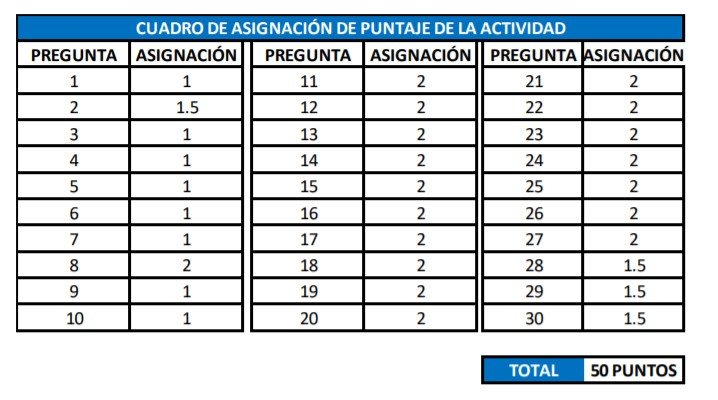

> **INDICACIONES. – Resolver lo que se solicita, en una hoja adicional deberás incluir el procedimiento, una
vez finalizado digitaliza la hoja de respuesta y genera un archivo extensión PDF, nombrando tu archivo
APELLIDO PATERNO APELLIDO MATERNO NOMBRE_ACTIVIDAD APRENDIZAJE 1**

1. **¿Por qué debes de usar la temperatura absoluta en la Ley de Charles?**
    - *Porque cuando se extrapola a cero, la temperatura de un gas es la del cero absoluto (0K)*
2. **Un tanque de acero cerrado se llena con un gas ideal y se calienta. ¿Qué sucede con (a) la masa,
(b) volumen, (c) la densidad y (d) la presión del gas?**
    - 
3. Señale la diferencia entre evaporación, ebullición y sublimación.
4. A partir de su experiencia, ¿esperaría usted que el alcohol tenga una presión de vapor más alta
que el agua? ¿Por qué?
5. Explique el principio de operación de la olla de presión y la olla de vacío como utensilios de cocina.
6. ¿Un sólido puede tener presión de vapor? Explique su respuesta.
7. Si la evaporación es un proceso de enfriamiento, ¿la condensación es entonces un proceso de
calentamiento? Explique su respuesta
8. Explique los procesos de enfriamiento que produce la evaporación, en función de calor latente de
vaporización.
9. ¿Es posible que exista hielo en equilibrio con agua hirviendo? Explique su respuesta.
10. ¿En dónde sería más fácil tomar agua con un popote, en la cima o en la falta del Monte Everest?
11. Un gas ideal ocupa un volumen de 4.00 m3
a una presión absoluta de 200 kPa. ¿Cuál será la nueva
presión si el gas es comprimido lentamente hasta 2.00 m3
a temperatura constante?
12. Un cilindro de acero contiene un gas ideal a 27°C. La presión manométrica es de 140 kPa. Si la
temperatura de recipiente se eleva hasta 79°C, ¿Cuál será la nueva presión manométrica?
13. Un compresor de aire recibe 2 m3 de aire a 20°C y a la presión de una atmosfera (101.3 kPa). Si el
compresor descarga un depósito de 0.3 m3
a una presión absoluta de 1 500 kPa ¿Cuál es la
temperatura del aire descargado?
14. La presión externa de un avión de propulsión que vuela a gran altitud es considerablemente menor
que la presión atmosférica estándar. Por ello, el aire interior de la cabina debe presurizarse para
proteger a los pasajeros. ¿Cuál es la presión (en atm) en la cabina si la lectura del barómetro es de
688 mmHg?
15. Una muestra de gas cloro ocupa un volumen de 946 mL a una presión de 760 mmHg. Calcule la
presión del gas (en mmHg) si el volumen se reduce a 154 mL y la temperatura permanece
constante.
16. Una muestra de gas monóxido de carbono ocupa 3.2 L a 125°C. Calcule la temperatura a la cual el
gas ocupará un volumen de 1.54 L, si la presión se mantiene constante.
17. Calcule el volumen (en litros) ocupado por 2.12 moles de óxido nítrico (NO) a 6.54 atm y 76°C.

18. Un gas que inicialmente tiene un volumen de 4 L, una presión de 1.2 atm y una temperatura de
66°C experimenta un cambio, de manera que su volumen y temperatura finales son de 1.7 L y
42°C. ¿Cuál es la presión final? Supóngase que el número de moles no ha cambiado
19. Una muestra de oxígeno gaseoso sometida a una presión inicial de 0.97 atm se enfría desde 21 °C
hasta -68°C a volumen constante. ¿Cuál es la presión final (en atm)?
20. En un proceso químico industrial, se proporcionan a un sistema 600 J de calor y produce 200 J de
trabajo. ¿Cuál es el incremento registrado en la energía interna de este sistema?
21. En un proceso termodinámico, la energía interna del sistema se incrementa en 500 J. ¿Cuánto
trabajo fue realizado por el gas si en el proceso fueron absorbidos 800 J de calor?
22. El volumen de un gas disminuye de 5 a 3 L bajo una presión constante de 2 atm. ¿Cuánto trabajo
se realiza? ¿Y se realiza sobre el gas o lo realiza éste? Si hay un incremento de 300 J en la energía
interna, ¿cuál es el intercambio neto de calor? Trace un bosquejo del proceso.
23. Durante una expansión isobárica, una presión constante de 250 kPa hace que el volumen de un
gas pase de 1 a 3 L. ¿Qué trabajo realiza el gas?
24. Un motor con 37% de eficiencia pierde 400 J de calor en cada ciclo. ¿Qué trabajo se realiza y cuánto
calor se absorbe en cada ciclo?
25. Una máquina de vapor recibe vapor sobrecalentado de una caldera que trabaja a 200°C y que lo
arroja directamente al aire a 100°C. ¿Cuál es la eficiencia ideal?
26. Un refrigerador extrae 400 J de calor de una caja en cada ciclo y expulsa 600 J hacia un recipiente
a alta temperatura. ¿Cuál es el coeficiente de rendimiento?
27. ¿Cuánto calor se extrae del recipiente frío si el compresor de un refrigerador realiza 180 J de
trabajo en cada ciclo? El coeficiente de rendimiento es 4.0. ¿Cuánto calor se expulsa hacia el
recipiente caliente?
28. ¿En qué ley se basa la primera ley de la termodinámica? Proporcione una explicación respecto de
los signos convencionales de la ecuación ΔE = q + w.
29. La energía interna de un gas ideal solo depende de su temperatura. Analice el siguiente proceso
de acuerdo con la primera ley. Se deja que una muestra de gas ideal se expanda a temperatura
constante contra la presión atmosférica. a) ¿el gas realiza un trabajo sobre sus alrededores? b)
¿hay intercambio de calor entre sistemas y los alrededores? si es así, ¿en qué dirección ocurre? c)
¿Cuál es ΔE del gas para este proceso?
30. ¿Cómo cambia la entropía de un sistema para cada uno de los siguientes procesos? a) un sólido se
funde, b) un líquido se congela, c) un líquido hierve, d) un vapor se convierte en sólido, e) un vapor
se condensa en un líquido, f) un sólido sublima, g) la urea se disuelve en agua 

