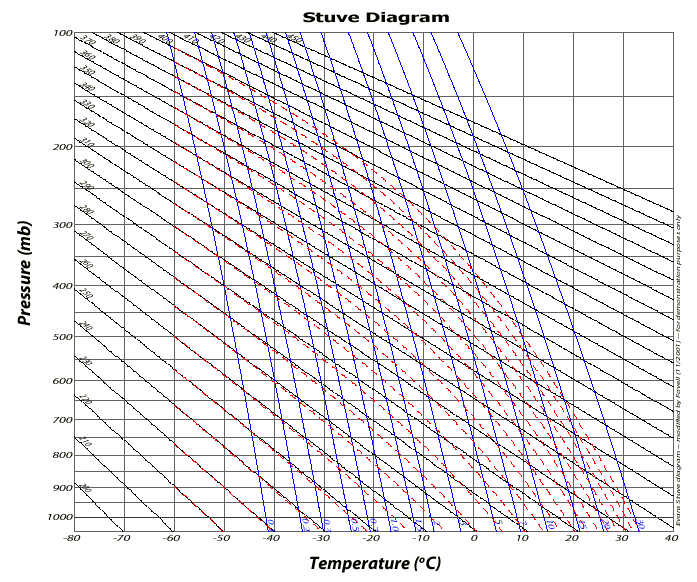

# Terminos procesos de termodinamica

1. **Fisicoquímica**:
    - Estudia la química en sus propiedades físicas y la estructura de la materia, las leyes de la inteacción química y las teorías que las gobiernan. 

2. **Energía**
    - Capacidada que tiene la materia de producir trabajo en forma de movimiento, luz, calor, etc.

3. **Calor** 
    - Energía que se manifiesta por un aumento de temperatura y procede de la transformación de otras energías; es originada por los movimientos vibratorios de los átomos y las moléculas que forman los cuerpos.

4. **Conducción** 
    - La conducción es la transferencia de energía de las particulas más enegéticas de una sustancia hacia las adyacentes menos energéticas. 

5. **Termostática** 
    - Campo de la física que describe y relaciona las propiedades físicas de sistemas macroscópicos de materia y energía.
    
6. **Termodinámica** 
    - Rama de la fisíca que estudia los sistemas macroscopicos para los cuales el efecto termico es importante. 

7. **Temperatura**
    - Es una propiedad termodinámica que estudia el movimiento de las moleculas que forman algun sistema en cuestion 

8. **Calorimetría**
    - Parte de la física que trata de la medición del calor y de las constantes térmicas.

9. **Termometría**
    - Parte de la termología que estudia la medición de la temperatura.

10. **Energía interna**
    - La suma de todas las formas microscópicas de energía se denomina **_energía interna_** de un sistema y se denota mediante la letra *U*

11. **Entalpía**
    - Es la suma de la energía interna *U*, el prducto de la presión *P* y el volumen *V* por lo que $U + PV$ es la entalpía y se representa con la letra *H* 
     $H = U + PV$
    
12. **Calor especifico**
    - Se define como la energía requerida para elevar la temperatura de una unidad de masa de una sustancie en 1 de una manera especifica. 

13. **Capacidad calorifica**
    - La capacidad calorífica o capacidad térmica de un cuerpo es el cociente entre la cantidad de energía calorífica transferida a un cuerpo o sistema en un proceso cualquiera y el cambio de temperatura que experimenta.

14. **$C_p$ y $C_v$** 
    - el proceso es a presión constante el calor específico tiene cierta medida y se le da el nombre de Calor específico a Presión constante o $C_p$ y si el proceso se da a volumen constante el calor específico tiene otra medida y se le da el nombre de Calor específico a Volumen constante o $C_v$

15. **Diagrama termodinamico**
    - Los diagramas termodinámicos son una variedad de los gráficos que llamamos "nomogramas". Los nomogramas son gráficos que tienen líneas que muestran soluciones a una serie de ecuaciones. Cada línea del diagrama representa cientos de soluciones para una determinada ecuación. Isotermas (líneas de temperatura constante)
    **_Ejemplo:_** 
    
16. **Proceso de combustion**
    - Un proceso de combustión es un tipo de reacción química exotérmica que origina un proceso de oxidación rápida de elementos combustibles que están formados, principalmente, por carbono e hidrógeno y en ocasiones, por azufre. A través de dicho proceso, se liberan grandes cantidades de energía térmica.

17. **Bomba de calor**
    - La bomba de calor es una máquina térmica que toma calor de un espacio frío y lo transfiere a otro más caliente gracias a un trabajo aportado desde el exterior, es decir, hace lo mismo exactamente que la máquina frigorífica, lo único que cambia es el objetivo

18. **Proceso de refrigeración** 
    - Durante el ciclo de refrigeración, el compresor absorbe refrigerante en forma de gas a baja presión de las bobinas del evaporador interior. ... Ahora a baja presión, el refrigerante se traslada al evaporador, que absorbe el calor del aire exterior y vuelve a convertir el líquido en gas.

19. **Batería**
    - Las baterías son dispositivos que almacenan energía eléctrica en forma química y la liberan después como corriente continua de forma controlada

20. **Proceso isotérmico**
    - Se denomina proceso isotérmico o proceso isotermo al cambio reversible en un sistema termodinámico, siendo en dicho cambio la temperatura constante en todo el sistema. 

21. **Proceso adiabático**
    - Se le llama proceso adiabático cuando un sistema no pierde ni gana calor, en otras palabras se considera proceso adiabático a un sistema especial en el cual no se pierde ni tampoco se gana energía calorífica. El término adiabático hace referencia a elementos que impiden la transferencia de calor con el entorno.

22. **Proceso isocórico**
    - Un proceso isocórico, también llamado proceso isométrico o isovolumétrico es un proceso termodinámico en el cual el volumen permanece constante; ${\displaystyle \Delta V=0}.$ Esto implica que el proceso no realiza trabajo presión-volumen, ya que este se define como:
    ${\displaystyle \Delta W=P\Delta V}{\displaystyle \Delta W=P\Delta V}$
    donde p es la presión, el trabajo es cero pues no hay cambio de volumen. 

23. **Proceso isobárico**
    - Un proceso isobárico es un proceso termodinámico en el que la presión se mantiene constante: ${\displaystyle \Delta P=0}.$ El calor transferido al sistema realiza trabajo, pero también cambia la energía interna del sistema. Este artículo utiliza la convención de signos de física para el trabajo, donde el trabajo positivo es el trabajo realizado por el sistema. Usando esta convención, por la primera ley de la termodinámica
    ${\displaystyle Q=\Delta U+W\,}{\displaystyle Q=\Delta U+W\,}$

24. **Proceso isométrico** 
    - Es el mismo que el isocórico

## Referencias 
*_[1] Yunus A.Cengel, Michael A. Boles, Mehmet Kanoglu. (2009). Termodinámica. Madrid: McGrawHill._*
*_[2] Yunus A. Cengel, Afshin J.Ghajar. (2004). Transferencia de calor y masa. México: McGrawHill._*