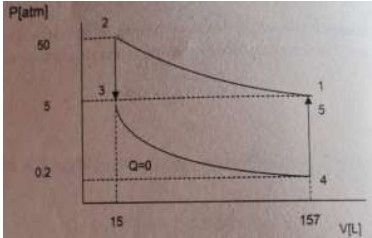
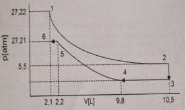

# Tarea 12 Hiram Isaí Torres Espinosa

## Primer Diagrama 

- 1-2 comprensión isotérmica. 
- 2-3 compresión isocorica ( a volumen constante)
- 3-4 Expansión isotérmica
- 4-5 Expansión isocórica

- 1-2 Expansión isotérmica 
- 2-3 Comprensión isocórica 
- 3-4 Comprensión isobárica 
- 4-5 Comprensión isotérmica 
- 5-6 Comprensión isocórica 
- 6-1 Expansión isocórica 

